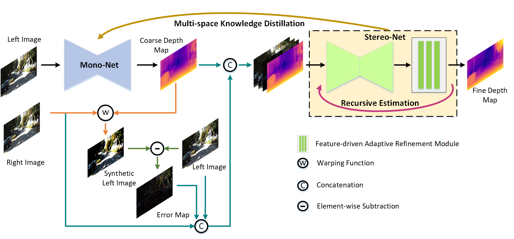
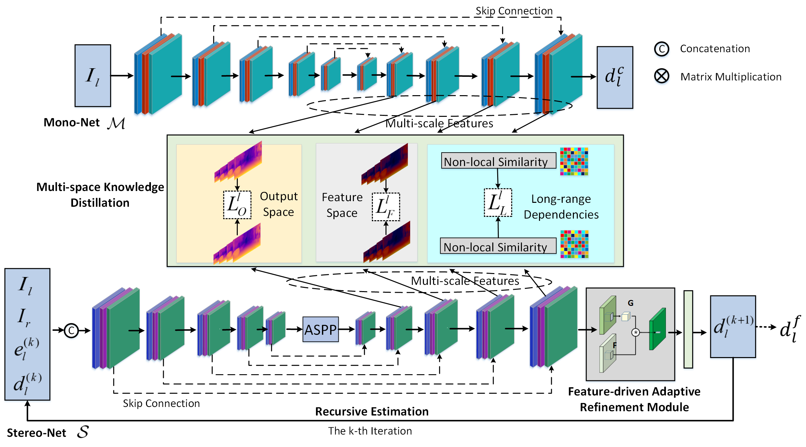

# Recursive_Stereo_Disill
Unsupervised Monocular Depth Estimation via Recursive Stereo Distillation(https://ieeexplore.ieee.org/document/9405457)
## Requirements
This work is implemented using Tensorflow 1.0 and python 2.7.

## Method
<p align="center">
  
</p>
<p align="center">Network overview</p>
<p align="center">
  
</p>
<p align="center">The detail structures of Mono-Net and Stereo-Net</p>

## Results
<p align="center">
  
  
</p>
<p align="center">Examples of input and output for our method</p>

## Train
```
python MS_main.py --mode=train --data_path=raw_data_path --filenames_file=./utils/filenames/kitti_train_files.txt --log_directory=models/ --model_name=Test_A --dataset=kitti --encoder=resASPPNet --batch_size=4 --num_epochs=50 --iter_number=2
```
## Test
```
python MS_main.py --mode=test --data_path=raw_data_path --filenames_file=./utils/filenames/eigen_test_files.txt --dataset=kitti --encoder=resASPPNet --checkpoint_path=Trained model --output_directory=./models/Test_A/ --iter_number=2 --do_stereo
```
```
python utils/evaluate_eigen.py --split=eigen --gt_path=raw_data_path --max_depth=80 --garg_crop --predicted_disp_path=predicted npy files for disp
```
We have prepared the testing results [here](https://pan.baidu.com/s/1dygNvYEmTAwStvI6q0o9mw), pwd：gt0E.
## Citation

If this codebase or our method helps your research, please cite:
```
@article{Ye2021tip,
   author = {Xinchen Ye, Xin Fan, Mingliang Zhang, Wei Zhong, Rui Xu},
   title = {Unsupervised Monocular Depth Estimation via Recursive Stereo Distillation},
   booktitle = {IEEE Trans. Image Processing (TIP)},
   year={2021}, 
   volume={0}, 
   pages={0-0}}
```


  

